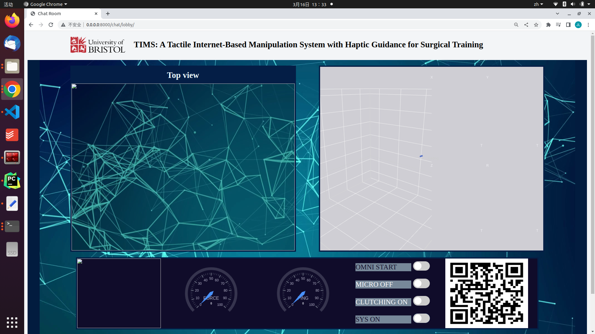
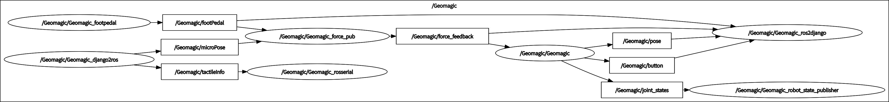
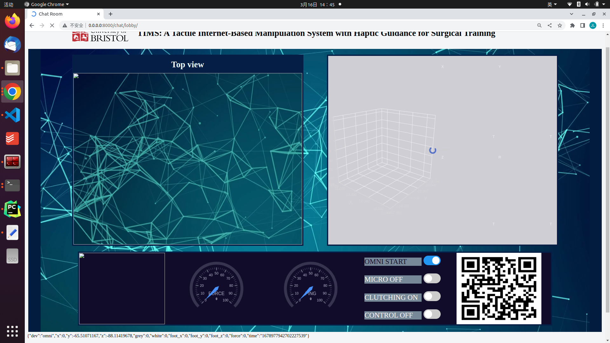
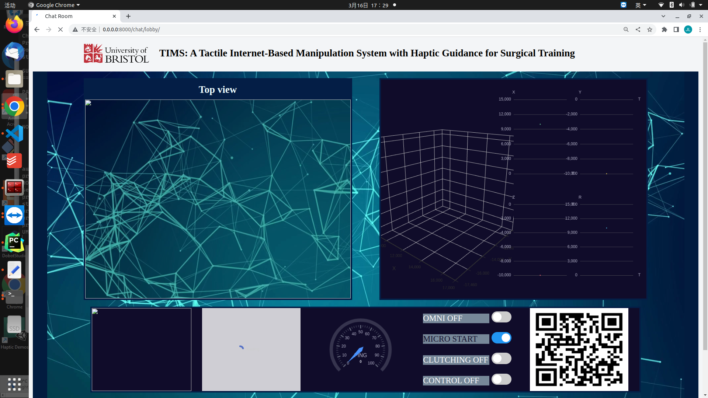
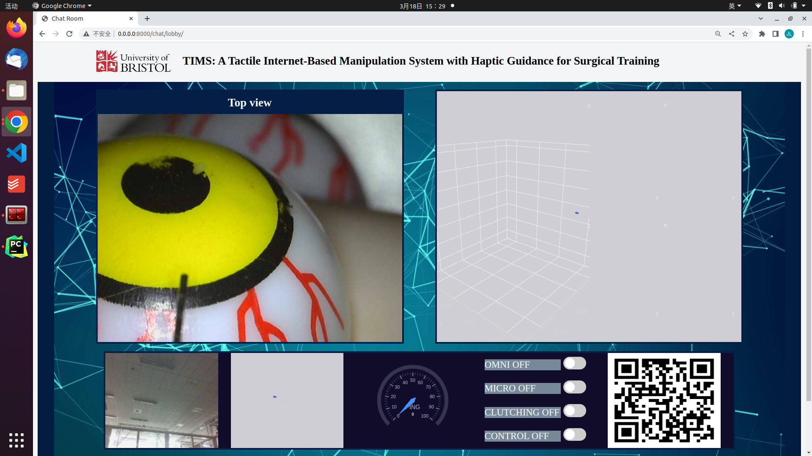

# TIMS Tutorial


The whole system can be devided into four parts:
1. Django 'server' for web rendering and data exchanging.
2. Leader ROS for controlling Geomagic Touch, Foot pedal and in-house Wearable Tactile Display(WTD).
3. Follower ROS for controlling Sensapex uMp.
4. Follower live video capturing and visual to tactile information transform.

## Platform Description
1. Django 'server': Ubuntu 20.04 + Anaconda + Django + daphne
2. Leader ROS: Ubuntu 20.04 + ros-noetic-desktop-full + Anaconda
3. Follower ROS: Windows 11 + ros-noetic-desktop-full + Anaconda

Plz note, in this tutorial, we deploy Django 'server' and leader ROS on one laptop.
## File Description
1. TIMS_DJANGO: Two django projects are included. LIVE_VIDEO is for receiving, storing and streaming live video from
follower side. TIMS_SITE is the main site.
2. TIMS_LEADER: Two ROS packages are included in *src* directory for leader robot controlling. An arduino code is provided for controlling WTD.
3. TIMS_FOLLOWER: ROS_WS is the follower ros work space for controlling micro robot. Video streaming is for sending live video to django 'server'.

## Django 'server'
**In the very beginning, a redis database should be installed, as we use it as the Django backend.**

**Check if redis has been installed:** 
```shell
  sudo systemctl status redis.
```
If redis is not installed, install it according to: <https://redis.io/docs/getting-started/installation/install-redis-on-linux/>

**Then, Configure django environment though Anaconda**
```shell
#Create new conda env:
conda create -n TIMS python=3.9
conda activate TIMS

#Install Django
pip install django

#Install cors-headers for pull video streaming:
pip install django-cors-headers

#Install daphne and channels_redis for Django Websocket_
python -m pip install -U channels["daphne"]
python -m pip install channels_redis
```

**The Django 'server' can be started through a shell script _server_start.sh_**. 
Go to _TIMS_DJANGO_:
```shell
cd TIMS_DJANGO
```
Edit this shell script firstly:
```shell
#This should be modified according to your anaconda path:
source ~/anaconda3/bin/activate TIMS
```
run .sh in terminal by:
```shell

./server_start.sh
```
Then go to <http://0.0.0.0:8000/chat/lobby> test if django sever is working. If you want to
access it from other device in local network, go to <http://server_IPv4_address:8000/chat/lobby>


## Leader ROS
### Configure ROS env

**Install ROS noetic according to <http://wiki.ros.org/noetic/Installation/Ubuntu>**

In TIMS, We use Arduino to control WTD, so rosserial_arduino according to <http://wiki.ros.org/rosserial_arduino>.
If you do not need to communicate with Arduino, ignore it. 

Also, we use Geomagic Touch in TIMS, install OpenHaptics Installer and Haptic device driver Installer on your laptop according to <https://support.3dsystems.com/s/article/OpenHaptics-for-Linux-Developer-Edition-v34?language=en_US>

When the _box test_ for Geomagic Touch is passed, then move on to the next step.

Go to _TIMS_LEADER_:
```shell
cd /TIMS_LEADER
```
**Install following python packages**
```shell
#make sure you are in TIMS_LEADER.
pip install -r requirements.txt
```

### Build and Run Leader ROS
cd into TIMS_LEADER, there are two directories and one shell script. In the directory _src_, _geomagic_control_ is for controlling all devices from leader side, _geomagic_desciption_
is for publishing status of Geomagic Touch. The directory _tactile_arduino_ is the arduino code for WTD. And _ros_start.sh_ is for running all leader ROS.

All topics and nodes are shown in the following rqt graph:


To build a work space for these two packages, make sure you are in the Directory of _TIMS_LEADER_, 
then execute following commend in terminal to **build ROS**:
```shell
conda activate TIMS
catkin_make
```

**Modify shell script** for quick start.
```shell
#make sure you set the correct path for conda env.
source ~/anaconda3/bin/activate TIMS
```


**Run shell script for starting Leader robots**, also, you can enable or disable some nodes in
_src/geomagic_control/launch/geomagic_headless.launch_
```shell
./ros_start.sh
```
Plz keep in mind, you should run server before running ros, as ros tries to send msg to server.
So, First, start Django 'server' as last section. Then run ros_start.sh. if
OMNI START button change into blue and there are some texts in the lowest of web page, means Leader ROS running well.


## Follower ROS
### Config ROS env
Install ROS noetic on windows, according to <http://wiki.ros.org/noetic/Installation/Windows>.

Open x64 Native Tools Command Prompt for VS 2019 and execuate:

```
conda create -n TIMS python=3.9
conda activate TIMS
pip install numpy==1.21.1
pip install sensapex
pip install websocket-client
```
Go to TIMS_FOLLOWER\ROS_WS\, to build follower ROS packages.
```
#Load environment variables for ROS, before that, plz quit all Command Prompt and open a new 
x64 Native Tools Command Prompt for VS 2019, also, keep conda deactivate.
#otherwise, there will be an error when execuate following commands. More specifically, conda cant be started
before the following command, even though deactivating after activating.

C:\opt\ros\noetic\x64\setup.bat

#edit the following command according to your virtual env's path

catkin_make -DPYTHON_EXECUTABLE=C:\Users\dianz\Anaconda3\envs\TIMS\python.exe
```
Modify ros_start.bat for quick start
```bat
#active virtual env
call conda activate TIMS

#Load environment variables for ROS
call C:\opt\ros\noetic\x64\setup.bat

#Load environment variables for Follower ROS packages
call .\devel\setup.bat

#Launch ros and specify target django 'server' IP(IPv4 address), eg:
call roslaunch micro_control_pkg launch.launch IP:=10.167.98.208
```


Save and Double click ros_start.bat. Follower ROS starts to run. Plz note, run Django sever before running follower ROS.

Open web page again, then you can see MICRO START button turns into blue, meaning run successfully.


## Follower Live Video
This part is mainly about using UDP protocol to send video to Django 'server'. We need to config python
environment again as yolov5 is used in TIMS. The specific method can be checked in <https://pytorch.org/hub/ultralytics_yolov5/#:~:text=YOLOv5%20%F0%9F%9A%80%20is%20a%20family,to%20ONNX%2C%20CoreML%20and%20TFLite.>

Plz note, if you do not need yolov5 to do the same work as TIMS, you can modify it according to your preference.
Then, we use websocket to communicate with Django 'server', so it should be installed in by:
```shell
pip install websocket-client
```

Go to *TIMS_FOLLOWER/Video_Streaming*, Modify the .bat for quick start:
```shell
# activate your env
call conda activate yolov5
# start one CAM, and sent it to the target IPv4. source arg is to choose cam for CV2.videocapture(source),
#camPostion is for indicating postion in web page, it can be 1 or 2 in TIMS
start python udp_camClient.py --targetIP 10.167.98.208 --source 0 --camPosition 1

start python .\yolov5\yolov5\detect.py --targetIP 10.167.98.208 --source 1 --camPosition 2

```
Run .bat
```shell
.\video.bat
```
Then you can see the video has been streamed on the web page as:


So far, the TIMS system has started.